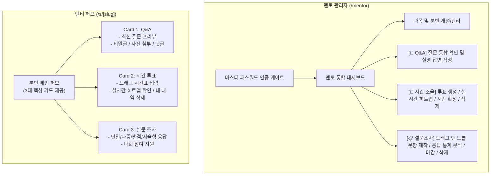

# 🎓 SMP (Student Mentoring Program) 웹 플랫폼

> **대학생 멘토링을 위한 멘티 무회원가입(Zero-Signup) 기반 올인원 플랫폼**  
> **질의응답(Q&A) · 시간 조율(Schedule) · 설문조사(Survey)**를 카카오톡 단톡방 링크 클릭 한 번으로 손쉽게 해결합니다.

---

## 🌟 핵심 특징 (Key Features)

- 🚫 **멘티 무회원가입 (Zero-Signup)**: 멘티는 회원가입이나 로그인 없이 멘토가 공유한 단톡방 링크(`/s/[slug]`)로 즉시 접속합니다.
- 🔒 **이름 + 4자리 PIN 간이 인증**: 비회원 상태에서도 본인 질문 열람, 비밀글 보호, 시간표 수정 및 삭제가 안전하게 작동합니다.
-  **Q&A 질의응답 시스템**: 비밀글 보호, 사진 첨부(Supabase Storage), 멘토 실명 답변(`이진혁`), 스레드형 댓글 및 접기/펼치기 지원.
- 🕒 **When2meet 스타일 시간 조율**: 터치/마우스 드래그 타임테이블, 실시간 인원 취합 히트맵, 멘토의 최종 멘토링 시간대 원클릭 확정.
- 📋 **올인원 설문조사 (Survey)**: 4종 문항 타입(단일선택, 다중선택, 5점 척도 별점, 주관식 서술형), 멘티 전용 제출 플로우, 멘토 실시간 응답 통계(바차트, 별점 분포, 서술형 모아보기).
- 🌙 **완벽한 다크 모드 & Anti-FOUC 엔진**: 라이트 / 다크 / 시스템 설정 동기화 3단계 지원, 페이지 깜빡임 없는 인라인 렌더링, 브라우저 자동완성(Autofill) 색상 왜곡 방지.
- 📱 **모바일 퍼스트 반응형 UX**: 카카오톡 인앱 브라우저와 스마트폰 터치 환경에 100% 최적화된 레이아웃 및 햅틱 인터랙션.

---

## 🖥️ 주요 기능 소개



### 1. 멘티 전용 분반 페이지 (`/s/[slug]`)
각 분반별로 고유한 URL 슬러그가 부여되어 타 분반과의 데이터가 철저히 격리됩니다.

#### 💬 1. Q&A (질의응답 게시판)
- **질문 등록**: 제목, 내용, 작성자 이름/닉네임, 4자리 비밀번호(PIN), 문제 사진/캡처 이미지 첨부 지원
- **비밀글 보호**: 비밀글 옵션 체크 시 작성자(이름+PIN 일치) 및 멘토만 본문을 열람할 수 있도록 안전하게 보호
- **내 질문 찾기**: 이름과 4자리 PIN을 입력하여 본인이 작성한 질문들만 즉시 모아보고 잠금 해제
- **댓글 소통 & 접기/펼치기**:
  - 멘토의 공식 실명 답변(`이진혁`) 및 멘티 간 댓글 등록/삭제 (이름+PIN 검증)
  - 댓글이 3개 이상일 경우 기본 2개만 보여주고 `[댓글 N개 더보기 ∨]` / `[댓글 접기 ∧]` 토글 지원

#### 🕒 2. 시간 투표 (When2meet 스타일)
- **시간표 입력 (Grid)**:
  - 평일(월~금) 13:00 ~ 21:00 타임테이블
  - 학부 정규 수업 시간(월/목 13:00~18:00) 자동 비활성화로 멘토링 시간 충돌 방지
  - 터치 및 마우스 드래그로 가능한 시간대를 자유롭게 선택 및 `[선택 초기화]`
- **취합 결과 (Heatmap)**:
  - 참석 가능 인원 수에 따라 색상이 짙어지는 직관적인 히트맵 시각화
  - 멘토가 확정한 최종 멘토링 시간대 하이라이트 표시
- **내 제출 내역 삭제**:
  - 취합 결과 탭에서 `[내 제출 내역 삭제]` 버튼 클릭 후 **[작성자 이름 + 4자리 PIN]** 검증을 거쳐 본인 데이터만 안전하게 삭제

#### 📋 3. 설문 조사 (Survey)
- **제출 전용 플로우**: 멘티는 결과 통계에 영향을 받지 않고 오직 솔직한 피드백 제출에만 집중할 수 있는 깔끔한 뷰 제공
- **4가지 문항 타입 완벽 지원**:
  - 단일 선택 (Radio)
  - 복수 선택 (Checkbox)
  - 5점 척도 별점 평가 (Interactive Star Rating)
  - 주관식 서술형 (Textarea)
- **다회 참여 지원**: 브라우저 로컬 저장소 차단 없이 필요한 경우 여러 번 응답 제출 가능

---

### 2. 멘토 관리자 대시보드 (`/mentor`)
- **마스터 패스워드 게이트**: 복잡한 절차 없이 마스터 비밀번호로 즉시 대시보드 접근
- **과목 및 분반 관리**: 과목 추가, 분반 개설, 분반 접속 링크 원클릭 복사
- **3대 모듈형 탭 인터페이스**:
  - **`[💬 Q&A]` (기본 노출)**: 미답변 질문 수 뱃지 표시, 전체 질문 열람 및 공식 실명 멘토 답변 작성
  - **`[📅 시간 조율]`**: 투표 개설 및 마감/삭제, 실시간 제출 현황(히트맵) 모니터링, 최적 시간대 원클릭 확정
  - **`[📋 설문조사]`**:
    - **고도화된 설문 제작 모달**: 4종 문항 타입, 문항 드래그 앤 드롭 순서 변경, 문항 원클릭 복제, 필수 응답 토글
    - **통합 결과 분석 모달**: 총 응답 수 집계, 객관식 백분율 바차트, 별점 평균 점수 및 분포도, 주관식 답변 모아보기, 실시간 설문 마감/재개 및 설문 삭제(`🗑️`)

---

### 3. 테마 및 브라우저 호환성 최적화
- **완벽한 다크 모드 (Dark Mode)**:
  - 헤더 우측 상단 테마 토글 버튼을 통해 **라이트 / 다크 / 시스템 설정** 3단계 선택 지원
  - Slate 색상군 기반의 눈이 편안한 딥 차콜 다크 팔레트
  - 초기 접속 시 깜빡임(FOUC)을 완벽 차단하는 인라인 스크립트 엔진 탑재
- **브라우저 자동완성(Autofill) 색상 오버라이드**:
  - Chrome, Edge 등의 브라우저가 비밀번호 필드에 강제 주입하는 연하늘색(`rgb(232, 240, 254)`)을 Inset Box-Shadow 기법으로 오버라이드하여 라이트 모드(순백색)와 다크 모드(다크 슬레이트) 모두 일체감 있는 UI 유지

---

## 🛠️ 기술 스택 (Tech Stack)

| 레이어 | 기술 | 설명 |
| :--- | :--- | :--- |
| **Framework** | **Next.js 15.2 (App Router)** | 모바일 브라우저 초고속 로딩, SSR & 정적 최적화 |
| **Frontend** | **React 19, TypeScript 5.8** | 최신 React 19 컴포넌트 아키텍처 및 엄격한 타입 안정성 |
| **Styling** | **Tailwind CSS, Lucide React** | 유틸리티 퍼스트 반응형 스타일링, 다크 모드, 경량 아이콘 세트 |
| **Database & Auth** | **Supabase (PostgreSQL)** | RLS(Row Level Security) 기반 데이터 격리 및 보호, BaaS |
| **Storage** | **Supabase Storage** | 질문 첨부 이미지(`qna-images` 버킷) 안전 업로드 |
| **Deploy** | **Vercel** | Git 연동 무중단 글로벌 자동 배포 |

---

## 📁 프로젝트 구조 (Project Structure)

```text
SMP/
├── app/
│   ├── layout.tsx                    # 글로벌 루트 레이아웃 (Anti-FOUC 스크립트 포함)
│   ├── page.tsx                      # 인덱스 홈 (멘토 대시보드 링크 제공)
│   ├── not-found.tsx                 # 404 페이지 (다크모드 지원)
│   ├── globals.css                   # 글로벌 스타일, 컬러 스킴 및 Autofill 오버라이드
│   ├── mentor/
│   │   └── page.tsx                  # 멘토 관리자 대시보드 게이트
│   └── s/
│       └── [slug]/
│           ├── page.tsx              # 멘티 분반 허브 (Q&A, 시간 투표, 설문 조사 카드)
│           ├── qna/
│           │   └── page.tsx          # Q&A 게시판 전용 페이지
│           ├── schedule/[pollId]/
│           │   └── page.tsx          # 시간 조율 단독 페이지
│           └── survey/[surveyId]/
│               └── page.tsx          # 설문조사 제출 전용 페이지
├── components/
│   ├── mentee/
│   │   ├── QnaPreviewCard.tsx        # 멘티 허브 Q&A 카드
│   │   ├── PollListCard.tsx          # 멘티 허브 시간 투표 카드
│   │   └── SurveyListCard.tsx        # 멘티 허브 설문 조사 카드
│   ├── mentor/
│   │   ├── MentorDashboard.tsx       # 멘토 대시보드 메인 컴포넌트
│   │   ├── MentorSectionCard.tsx     # 분반별 모듈형 카드 (Q&A, 스케줄, 설문 탭)
│   │   ├── MentorPasswordGate.tsx    # 마스터 패스워드 인증창
│   │   ├── CreateCourseModal.tsx     # 과목 개설 모달
│   │   ├── CreateSectionModal.tsx    # 분반 개설 모달
│   │   ├── CreatePollModal.tsx       # 시간 투표 개설 모달
│   │   ├── CreateSurveyModal.tsx     # 설문조사 생성 모달 (순서 이동/복제)
│   │   ├── SurveyResultsModal.tsx    # 설문 결과 분석 및 마감/삭제 모달
│   │   └── AuthModal.tsx             # 멘토 로그인/가입 모달
│   ├── qna/
│   │   ├── QuestionBoard.tsx         # Q&A 게시판 메인 (질문, 답변, 댓글, 필터)
│   │   └── CreateQuestionModal.tsx   # 질문 등록 모달 (이미지 업로드 포함)
│   ├── schedule/
│   │   ├── ScheduleGrid.tsx          # 시간표 드래그/터치 선택 그리드
│   │   ├── ScheduleHeatmap.tsx       # 참석 현황 실시간 취합 히트맵
│   │   ├── SubmissionModal.tsx       # 이름 + PIN 입력 시간표 제출 모달
│   │   └── DeleteSubmissionModal.tsx # 이름 + PIN 검증 제출 내역 삭제 모달
│   └── theme/
│       ├── ThemeProvider.tsx         # 다크모드/라이트모드 컨텍스트 제공자
│       └── ThemeToggle.tsx           # 헤더 우측 상단 테마 토글 드롭다운
├── lib/
│   ├── supabase/
│   │   ├── client.ts                 # 브라우저용 Supabase 클라이언트
│   │   └── server.ts                 # 서버용 Supabase 클라이언트
│   └── utils.ts                      # 유틸리티 함수
├── types/
│   └── database.ts                   # Supabase DB 테이블 TypeScript 타입 정의
├── supabase_schema.sql               # 전체 Supabase 테이블 & RLS 기초 스키마
├── mock_data_and_schema_update.sql   # 단일 멘토 모드 권한 및 기초 프로필 스키마
├── fix_schedule_submission_delete_rls.sql # 시간표 제출 내역 삭제 RLS 패치
├── add_surveys_schema.sql            # 설문조사 모듈 테이블 & RLS 스키마
└── package.json
```

---

## 🚀 시작하기 (Getting Started)

### 1. 저장소 클론 및 패키지 설치

```bash
git clone https://github.com/your-repo/smp-platform.git
cd smp-platform
npm install
```

### 2. 환경 변수 설정 (`.env.local`)

프로젝트 루트에 `.env.local` 파일을 생성하고 Supabase 프로젝트의 API 키와 멘토 마스터 비밀번호를 설정합니다:

```env
# Supabase Configuration
NEXT_PUBLIC_SUPABASE_URL=https://your-project.supabase.co
NEXT_PUBLIC_SUPABASE_ANON_KEY=your-supabase-anon-key

# 멘토 관리자 마스터 비밀번호 (원하는 비밀번호로 변경 가능)
MENTOR_PASSWORD=smp1234
```

### 3. 데이터베이스 초기화 (Supabase SQL Editor)

1. [Supabase 콘솔](https://supabase.com/dashboard)에 접속하여 프로젝트를 생성합니다.
2. **SQL Editor**로 이동하여 다음 파일들을 순서대로 실행합니다:
   1. [`supabase_schema.sql`](./supabase_schema.sql) : 기본 테이블 및 RLS 기초 스키마 생성
   2. [`mock_data_and_schema_update.sql`](./mock_data_and_schema_update.sql) : 멘토 프로필 및 단일 멘토 권한 설정
   3. [`fix_schedule_submission_delete_rls.sql`](./fix_schedule_submission_delete_rls.sql) : 시간표 제출 내역 삭제 RLS 적용
   4. [`add_surveys_schema.sql`](./add_surveys_schema.sql) : 설문조사 모듈 테이블, 문항, 응답, 답변 테이블 및 RLS 적용
3. **Storage** 메뉴에서 `qna-images` 버킷을 생성하고 **Public**으로 설정합니다.

### 4. 로컬 개발 서버 실행

```bash
npm run dev
```

브라우저에서 `http://localhost:3000`으로 접속하여 확인합니다.
- **멘토 대시보드**: `http://localhost:3000/mentor` (초기 비밀번호: `smp1234`)
- **멘티 분반 페이지**: `http://localhost:3000/s/[slug]`

---

## 🔒 보안 아키텍처 (Security Architecture)

- **Row Level Security (RLS)**:
  - `questions` & `answers`: 누구나 질문과 답변을 등록할 수 있으나, 비밀글은 프론트엔드 및 함수 인증을 거쳐야만 내용이 노출됩니다.
  - `schedule_submissions`: 시간표 현황은 익명 히트맵으로 누구나 조회할 수 있으며, 수정/삭제는 본인의 이름 및 4자리 PIN 확인을 통해서만 처리됩니다.
  - `surveys` & `survey_responses`: 멘티는 질문에 응답하고 제출할 수 있으며, 결과 통계 조회는 멘토 대시보드 권한을 통해서만 집계 및 노출됩니다.
- **분반 격리(Multi-tenant by Section)**:
  - 멘티는 전달받은 URL 슬러그(`s/[slug]`)에 종속되어 타 분반의 질문이나 시간표, 설문 데이터에 접근할 수 없습니다.

---

## 📦 프로덕션 빌드 & 배포 (Build & Deploy)

```bash
npm run build
npm run start
```

Vercel을 통해 Git 연동 원클릭으로 손쉽게 배포할 수 있으며, 환경 변수(`NEXT_PUBLIC_SUPABASE_URL`, `NEXT_PUBLIC_SUPABASE_ANON_KEY`, `MENTOR_PASSWORD`)를 Vercel 프로젝트 설정에 등록하면 즉시 안정적인 서비스 운영이 가능합니다.

---

## 📄 라이선스 (License)

본 프로젝트는 개인 및 교육용 목적으로 자유롭게 수정하고 활용할 수 있습니다.
