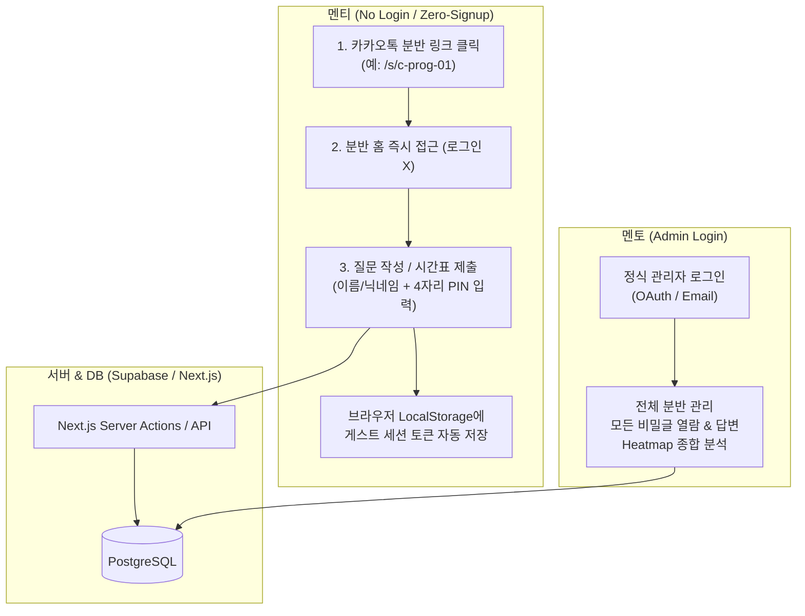
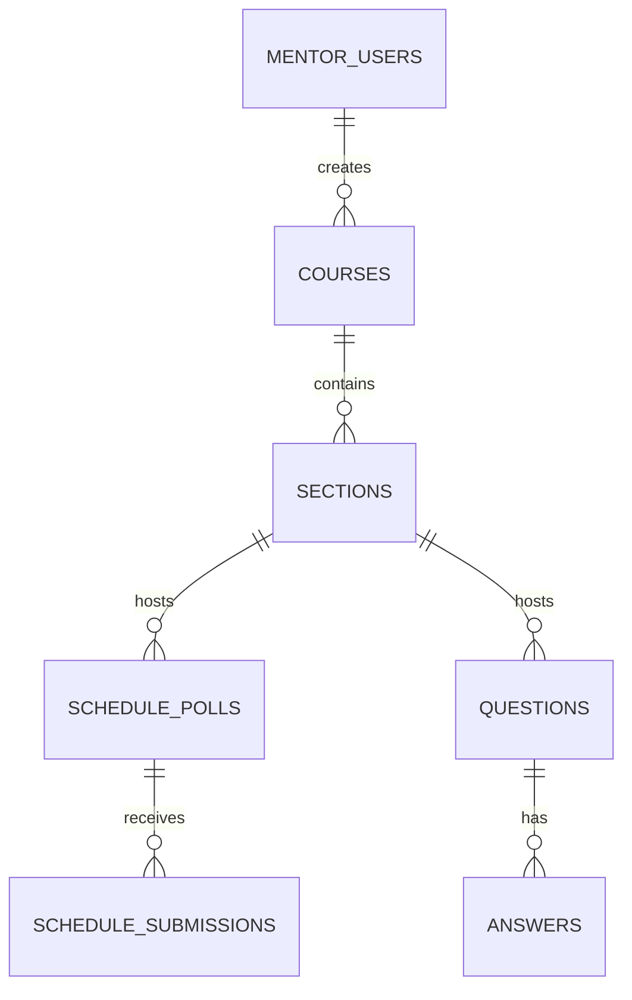

# 📋 SMP (Student Mentoring Program) 웹 플랫폼 구축 청사진 (v2.0)
### 🚀 [멘티 무회원가입(Zero-Signup) 초간편 UX 중심 설계]

> **문서 버전**: v2.0.0 (멘티 무회원가입 UX 최적화 개정판)  
> **작성일**: 2026-09-08  
> **대상 플랫폼**: Web (Mobile & PC 반응형 - 모바일 퍼스트)  
> **핵심 철학**: **"멘티에게 회원가입을 요구하지 않는다."** 링크 클릭 한 번으로 질문 작성 및 시간표 제출 완료!

---

## 1. 프로젝트 개요 및 핵심 UX 방향

### 1.1 해결하고자 하는 문제: "회원가입 장벽 제거"
멘토링을 받는 대학생(멘티)들에게 **"웹사이트에 가입해서 로그인하라"**는 요구는 참여율을 급격히 떨어뜨리는 가장 큰 원인입니다.
- 카카오톡 단톡방에서 웹 링크를 눌렀을 때, 회원가입이나 소셜 로그인 창이 뜨면 이탈률이 50% 이상 증가합니다.
- 따라서 **멘티는 회원가입/로그인 절차가 완전히 0(Zero)**이어야 하며, When2meet이나 네이버 폼처럼 **즉시 사용**할 수 있어야 합니다.

### 1.2 핵심 사용자 경험 (UX)
1. **멘토 (관리자)**:
   - 정식 로그인 (구글/이메일 간편 로그인)
   - 과목 및 분반 개설 ➔ **분반 전용 간편 링크(URL / QR코드)** 생성
   - 시간표 조율 생성, 히트맵 분석 및 최종 시간 확정
   - 비공개 질문 열람 및 공식 멘토 답변 작성
2. **멘티 (사용자)**:
   - **회원가입/로그인 전혀 없음**
   - 멘토가 단톡방에 보낸 링크(예: `smp.app/s/c-prog-01`)를 누르면 **그 분반 페이지로 즉시 진입**
   - **이름(또는 닉네임) + 4자리 비밀번호(간이 PIN)**만으로 질문 작성, 비밀글 보호, 시간표 제출/수정 완료

---

## 2. 무회원가입(Zero-Signup) 식별 및 보안 아키텍처

멘티가 회원가입을 하지 않더라도 **"누가 제출했는지"**, **"비밀 질문은 어떻게 본인과 멘토만 보는지"**, **"제출한 시간표를 나중에 어떻게 수정하는지"**를 해결하기 위해 **[이름 + 4자리 PIN + 브라우저 로컬 저장소]** 하이브리드 방식을 적용합니다.



### 2.1 멘티 식별 및 권한 작동 메커니즘
| 기능 | 작동 방식 (멘티 관점) | 기술적 구현 (백엔드 관점) |
| :--- | :--- | :--- |
| **분반 입장** | 링크 클릭 시 바로 해당 분반으로 진입 | URL 파라미터(`section_code`)를 통해 분반 컨텍스트 고정 |
| **시간표 제출** | 이름(예: `홍길동`) 입력 후 가능 시간 블록 터치 ➔ 저장 | `schedule_submissions`에 이름, 시간 데이터, 4자리 PIN 해시 저장 |
| **시간표 재수정** | 같은 기기로 접속 시 자동 인식되어 바로 수정 가능 (다른 기기 접속 시 이름 + 4자리 PIN 입력) | LocalStorage의 `guest_token` 확인 또는 이름+PIN 대조 인증 |
| **비밀 질문 작성** | '비밀글' 체크 후 4자리 PIN 설정 | `is_secret = true`, `pin_hash` 저장 |
| **비밀 질문 열람** | 멘티 본인이 열람 시: 4자리 PIN 입력(또는 본인 기기 세션 자동 통과)<br>멘토 열람 시: 관리자 권한으로 마스터 통과 | 멘토 토큰 검증 또는 제출된 PIN과 `pin_hash` 일치 여부 확인 |
| **익명 질문** | '익명' 체크 시 작성자명이 목록에 `익명`으로 노출 | 화면 표시 시 마스킹 처리 (멘토도 모르게 설정 가능) |

---

## 3. 추천 기술 스택

| 구분 | 기술 / 도구 | 선정 사유 |
| :--- | :--- | :--- |
| **프론트엔드** | **Next.js 15 (App Router)** + **TypeScript** | 모바일 브라우저 최적화, 빠른 로딩, SSR 지원 |
| **스타일링 & UI** | **Tailwind CSS** + **shadcn/ui** | 카카오톡 인앱 브라우저 및 모바일 기기 터치 최적화 UI 컴포넌트 |
| **백엔드 & DB** | **Supabase (PostgreSQL)** | 무료 티어로 충분한 데이터/스토리지 제공, 백엔드 서버 구축 공수 제로화 |
| **파일 스토리지** | **Supabase Storage** | 멘티가 올리는 질문 캡처/문제 사진 즉시 업로드 (용량 제한 및 압축 처리) |
| **암호화/인증** | **bcryptjs** (PIN 단방향 해싱) + **Next.js Cookie/LocalStorage** | 멘티 4자리 PIN을 안전하게 단방향 암호화하여 DB 저장 |
| **배포 및 호스팅** | **Vercel** | Git Push 시 자동 배포, 완전 무료 티어로 운영 가능 |

---

## 4. 핵심 기능 상세 설계

### 4.1 🕒 기능 1: 강의/멘토링 시간 결정 (When2meet 스타일 스케줄러)

#### 멘티 UX (30초 만에 끝나는 시간 제출)
1. 단톡방에 공유된 링크 클릭 ➔ `[2주차 보강 시간 조율]` 화면으로 직행
2. **이름/닉네임** 입력 (예: `김민수`)
3. **4자리 PIN** 입력 (기본값으로 전화번호 뒷자리 등 권장)
4. 주간 시간표 그리드에서 가능한 시간대를 **손가락으로 터치/드래그**하여 초록색으로 활성화
5. `[제출 완료]` 버튼 클릭 ➔ 즉시 저장 및 실시간 취합 히트맵 화면으로 전환

#### 멘토 UX (원클릭 최적 시간 도출)
1. **히트맵(Heatmap) 뷰**:
   - 참여한 모든 멘티들의 시간이 오버레이되어 겹치는 인원이 많을수록 진한 색상으로 표시
   - 시간 블록에 마우스 오버/터치 시: `"가능 인원 (4/5명): 김민수, 이영희, 박지성, 최진수 / 불가능: 정소미"` 팝업
2. **스마트 추천 배너**:
   - 상단에 **"전원 가능한 시간대: 금요일 14:00~16:00"** 또는 **"최다 인원(4명) 가능: 화요일 18:00"** 자동 분석 카드 노출
3. **시간 확정**:
   - 멘토가 시간 블록을 클릭하고 `[이 시간으로 확정하기]`를 누르면 투표가 마감되고 분반 최상단에 공지로 고정됨

---

### 4.2 💬 기능 2: 멘티 친화적 스마트 Q&A 게시판

#### 1) 간편 질문 등록 (모바일 최적화)
- 멘티 입력 폼:
  - **작성자 이름 / 닉네임**
  - **4자리 PIN** (수정/삭제/비밀글 열람용)
  - **제목 & 내용**
  - **사진 첨부**: 스마트폰 카메라로 문제집/화면 즉시 촬영 또는 갤러리 다중 업로드
  - **옵션 체크박스**:
    - `[ ] 🔒 비밀글로 작성 (멘토와 나만 보기)`
    - `[ ] 🕶️ 익명으로 올리기`
- 코드/수식 지원: 컴퓨터공학/수학 과목 멘토링을 위해 코드 블록 및 LaTeX 수식 자동 렌더링

#### 2) 비밀글 보안 및 열람 프로세스
- 목록 화면: `🔒 비밀글입니다. (작성자와 멘토만 볼 수 있습니다)`로 제목 마스킹
- **멘토가 클릭 시**: 관리자 계정으로 로그인되어 있으므로 별도 인증 없이 내용 즉시 열람 및 답변 작성
- **멘티가 클릭 시**:
  - 작성 당시의 브라우저 로컬 토큰이 일치하면 **즉시 열람**
  - 다른 기기이거나 토큰이 없으면 **"4자리 비밀번호를 입력하세요"** 모달 팝업 ➔ 일치 시 열람 성공

#### 3) 멘토 답변 및 피드백
- 멘토가 답변을 남기면 상태가 `[답변 완료 🟢]` 태그로 변경
- 멘토 답변은 **[멘토 공식 답변]** 파란색 강조 박스로 최상단 표시
- 하단에 추가 질문(댓글) 스레드 제공

---

### 4.3 🏢 기능 3: 다중 과목/분반 관리 (Multi-Class Scope)

- **멘토 전용 관리자 대시보드**:
  - 멘토는 상단 바에서 한 번의 클릭으로 담당 중인 과목과 분반을 손쉽게 전환:
    ```
    [2026-1학기 멘토링]
      ├── 📚 C프로그래밍 (1분반 / 2분반)
      └── 📚 자료구조 (A분반 / B분반)
    ```
  - 분반별 **[초대 링크 복사]** 버튼을 누르면 단축 URL 생성 (예: `https://smp.app/s/c-prog-01`)
- **멘티의 입장**:
  - 멘티는 본인의 단톡방에 올라온 링크만 누르면 되므로, 다른 과목이나 다른 분반의 존재를 신경 쓸 필요 없이 본인 분반 화면만 직관적으로 보게 됨

---

## 5. 데이터베이스 설계 (ERD & 스키마)

멘티는 `auth.users`에 저장되지 않고, 게시글 및 스케줄 테이블에 **작성자 정보와 PIN 해시값** 형태로 유연하게 저장됩니다.



### 5.1 테이블 정의서 (DDL)

#### 1) `mentor_profiles` (멘토 관리자 계정)
```sql
create table mentor_profiles (
  id uuid references auth.users on delete cascade primary key,
  email text not null,
  full_name text not null,
  created_at timestamp with time zone default now()
);
```

#### 2) `courses` & `sections` (과목 및 분반)
```sql
create table courses (
  id uuid default gen_random_uuid() primary key,
  mentor_id uuid references mentor_profiles(id) on delete cascade not null,
  semester text not null, -- e.g., '2026-1'
  title text not null,    -- e.g., 'C프로그래밍'
  created_at timestamp with time zone default now()
);

create table sections (
  id uuid default gen_random_uuid() primary key,
  course_id uuid references courses(id) on delete cascade not null,
  name text not null,        -- e.g., '1분반 (월요일)'
  slug text unique not null, -- URL용 고유 슬러그 e.g., 'c-prog-01'
  created_at timestamp with time zone default now()
);
```

#### 3) `schedule_polls` & `schedule_submissions` (시간표 조율)
```sql
create table schedule_polls (
  id uuid default gen_random_uuid() primary key,
  section_id uuid references sections(id) on delete cascade not null,
  title text not null,          -- e.g., '3주차 보강 일정 투표'
  dates jsonb not null,         -- ['2026-09-15', '2026-09-16', ...]
  start_time text not null,     -- '09:00'
  end_time text not null,       -- '21:00'
  slot_duration int default 30, -- 30분 단위
  is_closed boolean default false,
  confirmed_slot jsonb,         -- 확정된 시간 정보
  created_at timestamp with time zone default now()
);

-- 멘티의 무회원가입 시간 제출 테이블
create table schedule_submissions (
  id uuid default gen_random_uuid() primary key,
  poll_id uuid references schedule_polls(id) on delete cascade not null,
  participant_name text not null, -- 멘티 이름 (e.g., '홍길동')
  pin_hash text not null,         -- 4자리 PIN의 단방향 해시 (수정/확인용)
  guest_token text,              -- 브라우저 로컬 저장소 식별 토큰
  available_slots jsonb not null, -- ['2026-09-15T09:00', '2026-09-15T09:30', ...]
  updated_at timestamp with time zone default now(),
  unique(poll_id, participant_name) -- 동일 이름 중복 제출 시 덮어쓰기/업데이트
);
```

#### 4) `questions` & `answers` (비회원 친화형 Q&A)
```sql
-- 멘티의 무회원가입 질문 테이블
create table questions (
  id uuid default gen_random_uuid() primary key,
  section_id uuid references sections(id) on delete cascade not null,
  author_name text not null,      -- 멘티 이름 또는 닉네임
  pin_hash text not null,         -- 비밀글 해제 및 수정/삭제용 4자리 PIN 해시
  guest_token text,              -- 브라우저 로컬 세션 식별 토큰
  title text not null,
  content text not null,
  image_urls text[] default '{}',
  is_secret boolean default false,    -- 비밀글 여부
  is_anonymous boolean default false, -- 익명 표시 여부
  status text check (status in ('pending', 'resolved')) default 'pending',
  created_at timestamp with time zone default now()
);

create table answers (
  id uuid default gen_random_uuid() primary key,
  question_id uuid references questions(id) on delete cascade not null,
  author_name text not null,      -- 멘토 이름 또는 멘티 닉네임
  is_mentor boolean default false,-- 멘토 공식 답변 여부
  content text not null,
  created_at timestamp with time zone default now()
);
```

---

## 6. 화면 흐름 및 UI/UX 설계 (Mobile-First)

### 6.1 멘티의 진입 흐름 (클릭 ➔ 2초 만에 첫 화면)
```
[카카오톡 단톡방 공지 링크 클릭]
               │
               ▼
   [분반 홈 (/s/c-prog-01)]  <-- 회원가입/로그인 화면 일절 없음!
         │
         ├── 탭 1: 🕒 [강의 시간 투표] ➔ 이름 + PIN 입력 ➔ 시간 드래그 ➔ 저장 끝!
         │
         └── 탭 2: 💬 [질문 게시판] ➔ 질문 목록 확인 or [+ 질문하기] 탭
                     │
                     └── 사진 첨부 + 내용 입력 + 비밀/익명 체크 ➔ 등록 끝!
```

### 6.2 멘토의 진입 흐름
```
[웹사이트 우측 상단 '멘토 로그인' 버튼 클릭]
               │
               ▼
       [멘토 로그인 (Google)]
               │
               ▼
      [멘토 통합 대시보드]
         ├── 상단 분반 스위처: [C프로그래밍 1분반 ▼]
         ├── 스케줄 조율 생성 및 Heatmap 취합 결과 확인 (확정 버튼)
         ├── 모든 비밀 질문 자유롭게 열람 & 공식 멘토 답변 작성
         └── [초대 링크 복사] (카톡방에 뿌릴 단축 URL)
```

---

## 7. 보안 및 악용 방지 대책

1. **비밀 질문 프라이버시 보호**:
   - `is_secret = true`인 질문의 본문 및 첨부 이미지는 API 응답 시 마스킹 처리(`content: '비밀글입니다.'`).
   - 오직 **멘토 관리자 세션이 유효**하거나, 요청 시 **정확한 4자리 PIN이 검증**된 경우에만 원본 내용을 클라이언트에 전달.
2. **동일 이름 충돌 방지**:
   - 시간표 투표 시 다른 학생이 내 이름(예: `김철수`)을 입력하여 수정하려 할 경우: 기존에 설정된 4자리 PIN을 요구하여 남의 시간표를 함부로 덮어쓸 수 없도록 보호.
3. **도배 방지 (Rate Limiting)**:
   - IP 및 클라이언트 세션 기준 분당 질문 등록 횟수 제한(예: 1분에 최대 3개).

---

## 8. 단계별 개발 로드맵

```
[Phase 1: 기반 세팅 및 분반 링크 시스템]
  - Next.js 15 + Supabase 프로젝트 구성
  - 멘토 전용 로그인 및 과목/분반 생성 기능
  - 분반 전용 슬러그 링크(/s/[slug]) 라우팅 및 비회원 진입 페이지 구성

[Phase 2: 비회원 스마트 Q&A 구현]
  - 질문 등록 폼 (이름 + 4자리 PIN + 비밀글/익명 토글)
  - Supabase Storage 이미지 드래그/모바일 업로드 연동
  - 비밀번호 입력 모달을 통한 비밀 질문 해제 로직
  - 멘토 전용 공식 답변 작성 및 뱃지 표시

[Phase 3: When2meet 스타일 시간표 조율기]
  - 모바일 터치 & PC 드래그 지원 시간표 타임슬롯 그리드 컴포넌트
  - 멘티 시간 제출 (이름 + PIN + LocalStorage 자동 저장)
  - 취합 결과 히트맵(Heatmap) 및 툴팁 시각화
  - 멘토용 최적 시간대 추천 알고리즘 및 '시간 확정' 기능

[Phase 4: 편의 기능 및 배포]
  - 멘티의 질문 등록 시 멘토에게 이메일 또는 디스코드 웹훅 알림
  - 확정된 강의 일정 캘린더 등록(.ics 파일 다운로드) 지원
  - Vercel 프로덕션 배포 및 모바일 카카오톡 인앱 브라우저 테스트
```

---

## 9. 결론 및 향후 진행 가이드

본 청사진은 **멘티의 참여 장벽을 0(Zero)으로 만드는 동시에 멘토의 관리 효율을 극대화**하도록 설계되었습니다.
- 멘티는 앱 설치나 가입 없이 웹 링크만으로 100% 기능을 사용할 수 있습니다.
- 멘토는 하나의 관리자 계정으로 모든 분반과 질문을 한곳에서 일괄 통제할 수 있습니다.

추후 프로토타입 개발에 착수하실 때, 우선순위가 높은 기능(예: Next.js 프로젝트 셋업, When2meet 시간표 그리드 컴포넌트, 비회원 Q&A 폼 등)부터 순차적으로 구현을 진행하시면 됩니다.
